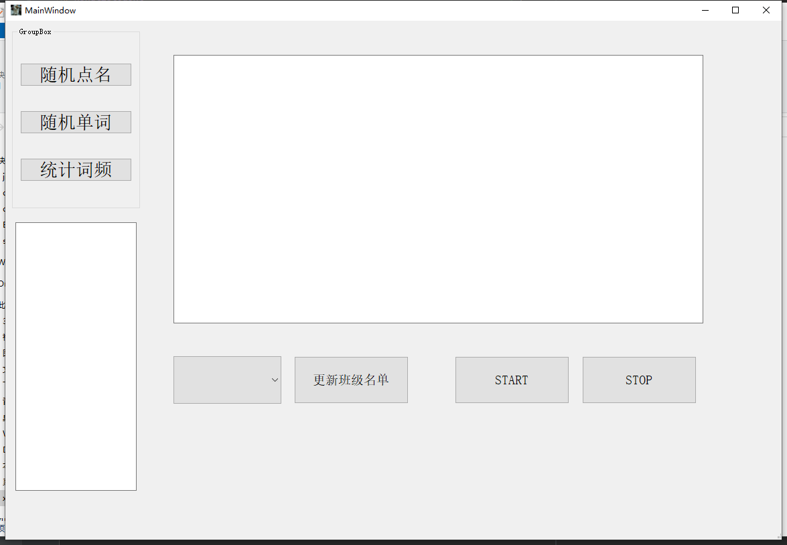

# hongliStudent
实现HongLi的一些教学需求，包含：随机点名、随机选择指定单词、统计词频、OCR识别试卷等

## 使用说明
- 总体样貌一览：

 

- 功能介绍：
  - 随机点名
  - 随机单词
  - 词频统计
  
- 预期功能
  - 根据词频统计单词，点击单词跳转到指定位置，并搜索当前数据库中，该单词的使用位置；
  - 点击统计单词，输出对应的所有词性、中文意思、短语等
  - 根据ocr识别试卷，分开保存每个题型，并统计每个题型的准确率等信息；
  - 单独为每个学生建立对应的表格，获取每个学生的各个单词、题型、短语掌握情况，输出准确率，以及对应的状态曲线；
  -  ...